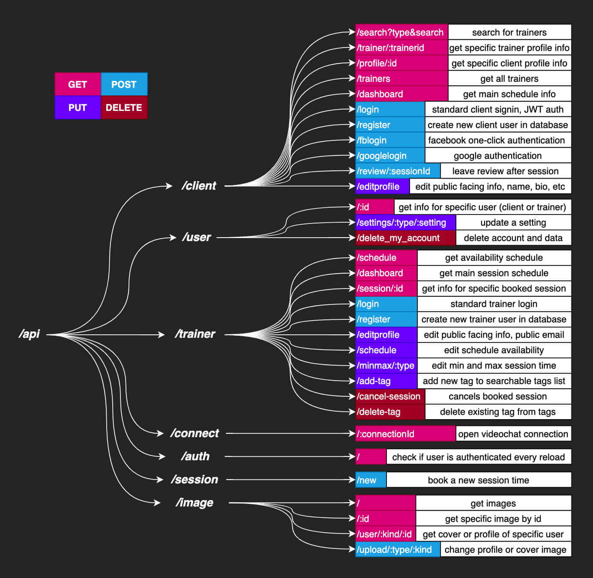

<h1 align='center'>FITRA</h1>

<h2 align='center'>Table of Contents</2>

<a href='#description'>Description</a>

<a href='#installation'>Installation</a>

<a href='#usage'>Usage</a>

<a href='#license'>License</a>

<a href='#questions'>Questions</a>

<h2>Description</h2>

A realtime videochat app for personal trainers and clients. Built with a MongoDB database, a Node/Express server, and a React user interface. The video chat functionality relies on websocket connections between users and the server which are used to open up a connection over the User Datagram Protocol directly between the users. Once a client has registered, signed in, and purchased a session, they and the trainer they've booked can access a page which is much like a websocket chatroom, except when a user enters it, the socket connection is used to request videostream connection data from other users in the room and send back one's own videostream after getting a response. This connects the trainer and client for encrypted peer-to-peer realtime communication.

Tests are written with Jest and React Testing Library. The front-end state is managed with React Context. Payment relies on a Paypal integration. Facebook and Google one-click login can be used to register/login for clients, though the Google login currently requires turning on third party cookies in browser settings.

The trainer schedule manager is based on a previous project, react-rnd-schedule, which uses a resize and drag-and-drop package called react-rnd to make a weekview schedule with resizable and dragable appointment times.

<h2>Installation</h2>

Download the repo and run

    npm run install-all

Also needed is a .env file in the root directory with a MONGO_URI property set to a mongoDB connection string and SECRET property set to whatever you want your secret to be, any long random string will do

To run the project locally use the command

    npm run dev

This will start the server at <a href="http://localhost:8000">localhost:8000</a>

And the user interface at <a href="http://localhost:3000">localhost:3000</a>

<h2>Usage</h2>

Trainers and clients can make accounts, edit their profiles, chat with other users over websocket connection, and view their schedule. Clients can use paypal to purchase sessions from trainers. Once a session is purchased, it shows up in the schedule of both the trainer and client. Once active, the session displays a link to a connect page which, when visited, creates an encrypted connection directly between the client and trainer via UDP protocol using PeerJS, after checking user authorization and session status

|                               
Description
                                |                                                
Demo
                                                 |
| :--------------------------------------------------------------------------------: | :-----------------------------------------------------------------------------------------------------------: |
|                   
Trainers and clients can make profiles
                    |                         |
|               
Clients can search for trainers by tag or name
                |  |
|        
Clients can purchase sessions from trainers with paypal
 
        |                        |
|                
Users can connect via UDP for videochat

                |          |
|            
Clients can leave reviews after a session is complete
            |                               |
|                      
Trainers can cancel sessions

                      |                    |
| 
Trainers can manage their schedule, blocking out times that are unavailable
 |               |
|             
Trainers can change their half-hourly rate and tags
             |     |
| 
Users can edit their profile profile info, profile picture, and cover photo
 |  |
|        
Users can send each other messages over websocket connection
         |               |

<h2>License</h2>

</img>

<h2>Questions</h2>

Any questions on this or other projects can be directed to thomasjfoydel@gmail.com 

<h2>More Of My Projects</h2>

Thanks for checking this out! Find more of my work on <a href='https://github.com/thomasfoydel'>my GitHub</a>

