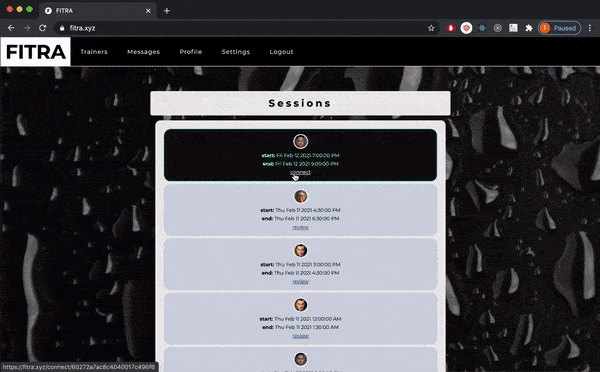

<h1 align='center'>FITRA</h1>

<a href='#description'>Description</a>

<a href='#installation'>Installation</a>

<a href='#usage'>Usage</a>

<a href='#license'>License</a>

<a href='#questions'>Questions</a>

<h2 >Description</h2>

A realtime videochat app for personal trainers and clients

<h2 >Installation</h2>

Download the repo and run npm i and npm run client-install. Also needed is a .env file in the root directory with a MONGO_URI set to a mongoDB connection string and SECRET set to whatever you want your secret to be, any long random string will do

<h2 >Usage</h2>

Trainers and clients can make accounts, edit their profiles, chat with other users over websocket connection, and view their schedule. Clients can use paypal to purchase sessions from trainers. Once a session is purchased, it shows up in the schedule of both the trainer and client. Once active, the session displays a link to a connect page which, when visited, creates an encrypted connection directly between the client and trainer via UDP protocol using PeerJS, after checking user authorization and session status

| Description                                                                                                                                                                               |                                                       Demo                                                       |
| ----------------------------------------------------------------------------------------------------------------------------------------------------------------------------------------- | :--------------------------------------------------------------------------------------------------------------: |
| <h3 class="h3">Trainers and clients can make profiles</h3>                                                                                                                                |           

            |
| <h3 class="h3">Clients can search for trainers by tag or name</h3>                                                                                                                        | 

 |
| <h3 class="h3">Clients can purchase sessions from trainers with paypal</h3> 
                                                                                                         |            

            |
| <h3 class="h3">Once a client has booked a trainer's session, those users can connect over UDP connection to videochat once the session is active and until the session is over</h3>
 |     

     |
| <h3 class="h3">Clients can leave reviews after a session is complete and the average rating of a trainer displays on their profile</h3>                                                   |               

                |
| <h3 class="h3">Trainers can cancel sessions</h3>
                                                                                                                                     |          

          |
| <h3 class="h3">Trainers can manage their schedule, blocking out times that are unavailable, recurring or not</h3>                                                                         |       

        |
| <h3 class="h3">Trainers can change their half-hourly rate and tags</h3>                                                                                                                   |  

   |
| <h3 class="h3">Users can edit their profile profile info, profile picture, and cover photo</h3>                                                                                           | 

 |
| <h3 class="h3">Users can send each other messages over websocket connection</h3>                                                                                                          |       

        |

<h2 >License</h2>

</img>
<h2 >Questions</h2>

Any questions on this or other projects can be directed to thomasjfoydel@gmail.com 

<h2 >More Of My Projects</h2>

Find more of my work on <a href='https://github.com/thomasfoydel'>my GitHub</a>

